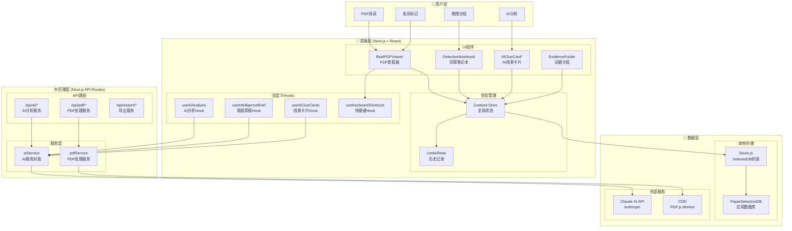
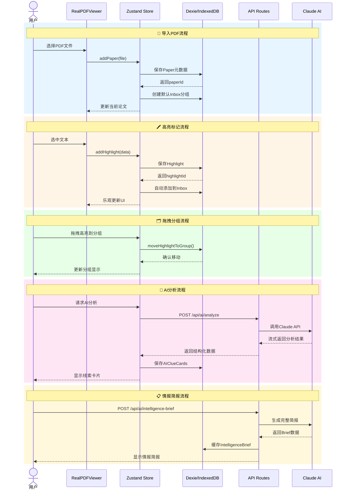
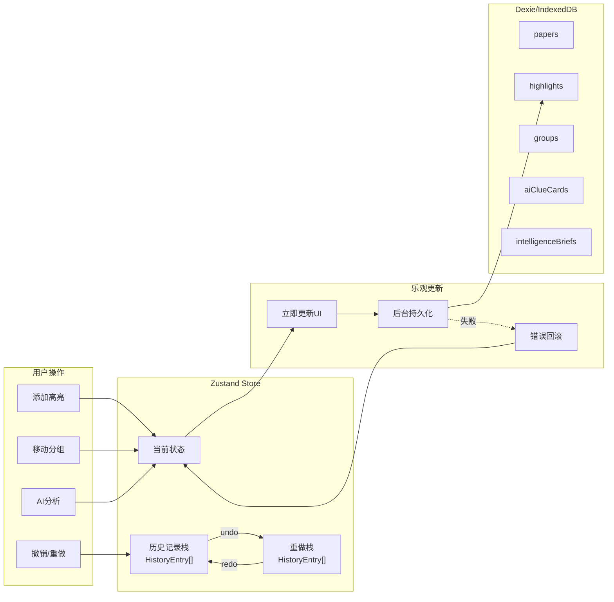
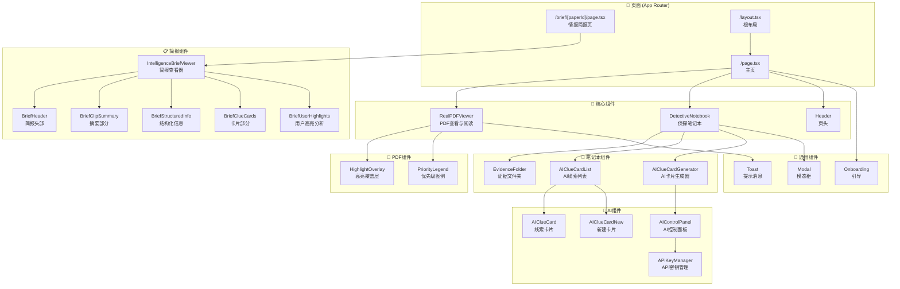
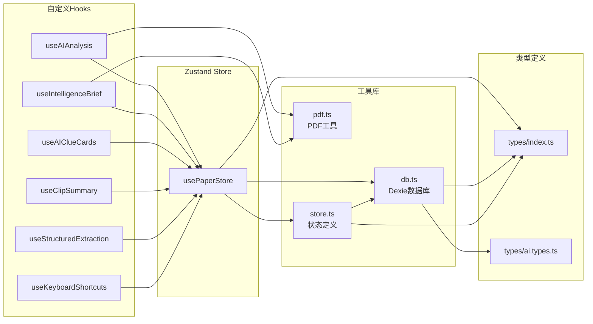
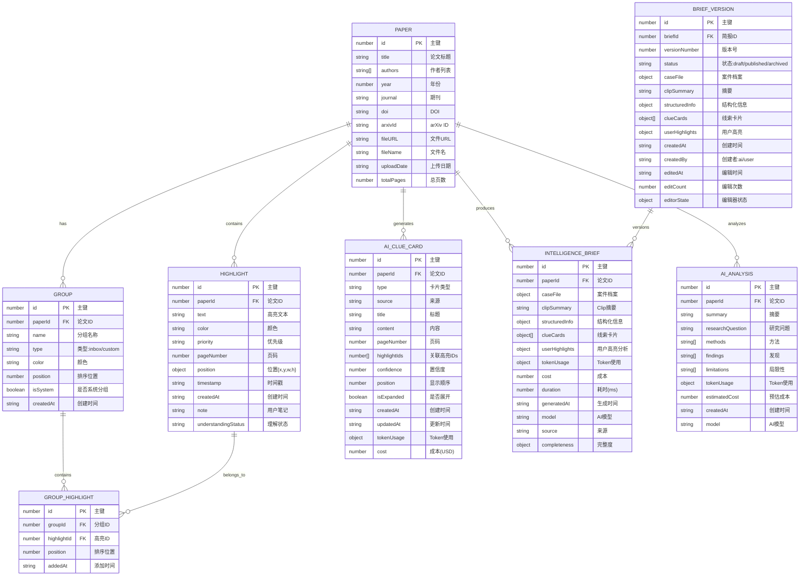
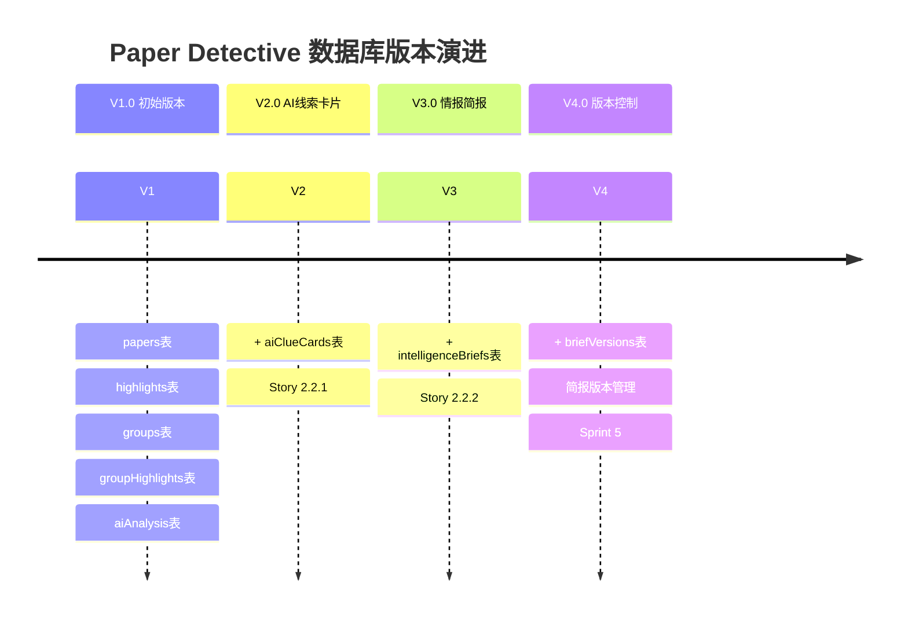
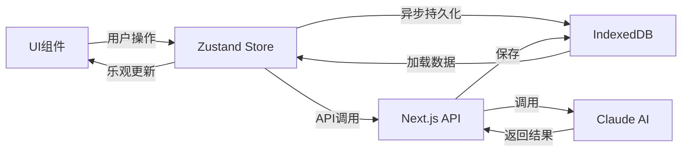
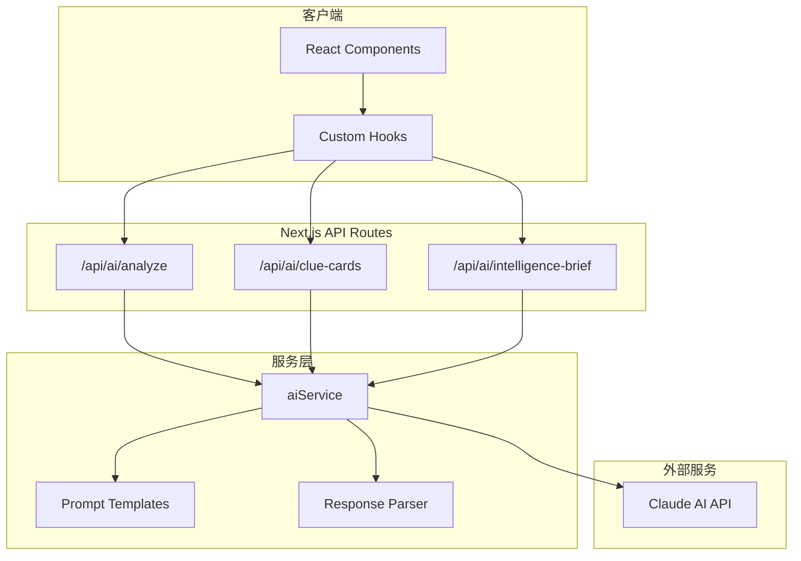

# Paper Detective - 架构设计文档

> 📰 游戏化科研文献阅读工具 - 架构全景图

## 目录

1. [技术栈概览](#技术栈概览)
2. [整体架构图](#整体架构图)
3. [数据流图](#数据流图)
4. [组件关系图](#组件关系图)
5. [数据库ER图](#数据库er图)
6. [目录结构](#目录结构)
7. [关键设计决策](#关键设计决策)

---

## 技术栈概览

| 层级 | 技术 | 用途 |
|------|------|------|
| **框架** | Next.js 15 + React 19 | 全栈React框架 |
| **语言** | TypeScript | 类型安全 |
| **PDF处理** | PDF.js + react-pdf | PDF渲染与文本提取 |
| **拖拽** | @dnd-kit | 现代化拖拽体验 |
| **状态管理** | Zustand | 轻量级状态管理 |
| **本地数据库** | Dexie.js + IndexedDB | 浏览器本地存储 |
| **样式** | TailwindCSS | 原子化CSS |
| **AI服务** | Claude AI API | 智能分析 |

---

## 整体架构图



---

## 数据流图

### 核心数据流



### 状态管理数据流



---

## 组件关系图

### 页面组件结构



### 组件依赖关系



---

## 数据库ER图

### 实体关系图



### 数据库Schema版本演进



---

## 目录结构

```
paper-detective/
├── app/                          # Next.js App Router
│   ├── page.tsx                  # 主页 - 双栏布局
│   ├── layout.tsx                # 根布局
│   ├── globals.css               # 全局样式 + 主题变量
│   ├── brief/                    # 情报简报页面
│   │   └── [paperId]/
│   │       └── page.tsx          # 动态路由简报页
│   └── api/                      # API路由
│       ├── ai/                   # AI服务API
│       │   ├── analyze/          # 综合分析
│       │   ├── clue-cards/       # 线索卡片
│       │   ├── clip-summary/     # Clip摘要
│       │   ├── intelligence-brief/  # 情报简报
│       │   └── structured-info/  # 结构化信息
│       ├── pdf/                  # PDF处理API
│       │   ├── extract-text/     # 文本提取
│       │   └── stats/            # PDF统计
│       └── export/               # 导出API
│           ├── markdown/         # Markdown导出
│           └── bibtex/           # BibTeX导出
│
├── components/                   # React组件
│   ├── RealPDFViewer.tsx         # PDF查看器(核心)
│   ├── DetectiveNotebook.tsx     # 侦探笔记本(核心)
│   ├── Header.tsx                # 页头
│   ├── HighlightOverlay.tsx      # 高亮覆盖层
│   ├── PriorityLegend.tsx        # 优先级图例
│   ├── EvidenceFolder.tsx        # 证据文件夹
│   ├── Modal.tsx                 # 模态框
│   ├── Toast.tsx                 # 提示消息
│   ├── Onboarding.tsx            # 用户引导
│   ├── AIAnalysisButton.tsx      # AI分析按钮
│   ├── AIClueCard.tsx            # AI线索卡片
│   ├── AIClueCardNew.tsx         # 新建卡片
│   ├── AIClueCardList.tsx        # 卡片列表
│   ├── AIClueCardGenerator.tsx   # 卡片生成器
│   ├── AIControlPanel.tsx        # AI控制面板
│   ├── APIKeyManager.tsx         # API密钥管理
│   └── brief/                    # 简报专用组件
│       ├── IntelligenceBriefViewer.tsx
│       ├── BriefHeader.tsx
│       ├── BriefClipSummary.tsx
│       ├── BriefStructuredInfo.tsx
│       ├── BriefClueCards.tsx
│       └── BriefUserHighlights.tsx
│
├── hooks/                        # 自定义Hooks
│   ├── useAIAnalysis.ts          # AI分析Hook
│   ├── useIntelligenceBrief.ts   # 情报简报Hook
│   ├── useAIClueCards.ts         # 线索卡片Hook
│   ├── useClipSummary.ts         # Clip摘要Hook
│   ├── useStructuredExtraction.ts  # 结构化提取Hook
│   └── useKeyboardShortcuts.ts   # 快捷键Hook
│
├── lib/                          # 工具库
│   ├── db.ts                     # Dexie数据库配置
│   ├── store.ts                  # Zustand状态管理
│   ├── pdf.ts                    # PDF处理工具
│   ├── errorTypes.ts             # 错误类型定义
│   └── utils/                    # 工具函数
│       └── format.ts             # 格式化工具
│
├── types/                        # TypeScript类型
│   ├── index.ts                  # 核心类型
│   └── ai.types.ts               # AI相关类型
│
├── services/                     # 服务层
│   └── aiService.ts              # AI服务封装
│
├── docs/                         # 文档
│   ├── ARCHITECTURE.md           # 本文档
│   ├── API_DOCUMENTATION.md      # API文档
│   ├── PRODUCT_REQUIREMENTS_DOCUMENT.md  # PRD
│   └── ...                       # 其他文档
│
├── public/                       # 静态资源
├── tests/                        # 测试文件
├── jest.config.js               # Jest配置
├── next.config.js               # Next.js配置
├── tailwind.config.ts           # Tailwind配置
└── tsconfig.json                # TypeScript配置
```

---

## 关键设计决策

### 1. 状态管理策略

| 状态类型 | 存储位置 | 说明 |
|---------|---------|------|
| 全局UI状态 | Zustand | 当前论文、高亮列表、分组状态 |
| 持久化数据 | IndexedDB (Dexie) | Papers、Highlights、Groups、AI结果 |
| 临时状态 | React useState | 模态框开关、加载状态 |
| 历史记录 | Zustand + 内存 | Undo/Redo栈 |

### 2. 数据流模式



### 3. 乐观更新机制

1. **立即更新UI**: 用户操作后首先更新Zustand状态
2. **后台持久化**: 异步保存到IndexedDB
3. **错误回滚**: 失败时恢复之前的状态

```typescript
// 伪代码示例
async addHighlight(highlight) {
  // 1. 乐观更新UI
  setState(prev => [...prev, highlight]);
  
  try {
    // 2. 后台保存
    const id = await db.highlights.add(highlight);
    // 3. 确认更新（替换临时ID）
    setState(prev => updateId(prev, tempId, id));
  } catch (error) {
    // 4. 错误回滚
    setState(prev => removeById(prev, tempId));
  }
}
```

### 4. AI服务架构



### 5. 安全考虑

- **API密钥**: 存储在环境变量，通过API路由代理调用
- **文件上传**: 限制50MB，仅接受PDF类型
- **数据隔离**: 所有数据存储在浏览器本地，无服务端持久化

### 6. 性能优化

| 优化点 | 实现方式 |
|-------|---------|
| PDF渲染 | react-pdf + 虚拟滚动 |
| 状态更新 | 乐观更新 + 批量处理 |
| 拖拽性能 | @dnd-kit + 防抖处理 |
| AI响应 | 流式输出 + 进度指示 |
| 数据库 | IndexedDB索引优化 |

---

## 附录

### A. 类型定义速查

```typescript
// 核心类型
interface Paper { id, title, authors, fileURL, ... }
interface Highlight { id, paperId, text, color, priority, position, ... }
interface Group { id, paperId, name, type, position, items, ... }
interface AIClueCard { id, paperId, type, title, content, confidence, ... }
interface IntelligenceBrief { id, paperId, caseFile, clueCards, ... }
```

### B. API端点速查

| 端点 | 方法 | 说明 |
|-----|------|------|
| `/api/ai/analyze` | POST | 综合分析论文 |
| `/api/ai/clue-cards` | POST | 生成线索卡片 |
| `/api/ai/intelligence-brief` | GET/POST/DELETE | 情报简报管理 |
| `/api/pdf/extract-text` | POST | 提取PDF文本 |
| `/api/export/markdown` | POST | 导出Markdown |

### C. 数据库版本

当前数据库版本: **V3** (包含 IntelligenceBriefs)

---

*文档版本: 1.0*  
*最后更新: 2026-02-13*  
*作者: Paper Detective Team*
